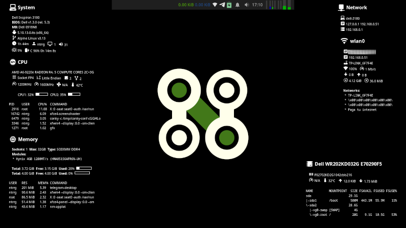

  

  

## Requirements

* [XFCE](https://xfce.org) >= 4.16
* [Conky](https://github.com/brndnmtthws/conky) >= 1.11
* [Material Design Icons Desktop TTF](https://github.com/Templarian/MaterialDesign-Font)
* [Materia GTK theme](https://github.com/nana-4/materia-theme)
* [Papirus icon theme](https://git.io/papirus-icon-theme)

## Features

* Simple smart-hide panel.

  1. Open applications.
  2. Network I/O monitor.
  3. Status area.
  4. Notification area.
  5. Audio controls.
  6. Clock.
  7. Timer.
  8. System monitor.
  9. Disk I/O monitor.
  10. Temperature sensors monitor.

* No title bars.

* Keyboard shortcuts.

  * <kbd>⌘</kbd> + <kbd>I</kbd> -> Invert screen colors (`xcalib`).
  * <kbd>⌘</kbd> + <kbd>K</kbd> -> Start `xkill`.
  * <kbd>⌘</kbd> + <kbd>P</kbd> -> Open display settings.
  * <kbd>⌘</kbd> + <kbd>L</kbd> -> Lock screen.
  * <kbd>⌘</kbd> + <kbd>Delete</kbd> -> Suspend.

  **Applications:**

  * <kbd>⌘</kbd> + <kbd>Space</kbd> -> Open application launcher.
  * <kbd>⌘</kbd> + <kbd>F</kbd> -> Open default file manager.
  * <kbd>⌘</kbd> + <kbd>M</kbd> -> Open Telegram.
  * <kbd>⌘</kbd> + <kbd>T</kbd> -> Open default terminal.
  * <kbd>⌘</kbd> + <kbd>W</kbd> -> Open default web browser.

  **Windows management:**

  * <kbd>⌘</kbd> + <kbd>D</kbd> -> Minimize/maximize all windows (show desktop).
  * <kbd>Alt</kbd> + <kbd>Tab</kbd> -> Cycle windows.
  * <kbd>Alt</kbd> + <kbd>Shift</kbd> + <kbd>Tab</kbd> -> Reverse cycle windows.
  * <kbd>⌘</kbd> + <kbd>Tab</kbd> -> Cycle windows from the same application.
  * <kbd>⌘</kbd> + <kbd>Shift</kbd> + <kbd>↑</kbd> -> Tile window to the top.
  * <kbd>⌘</kbd> + <kbd>Shift</kbd> + <kbd>↓</kbd> -> Tile window to the bottom.
  * <kbd>⌘</kbd> + <kbd>Shift</kbd> + <kbd>←</kbd> -> Tile window to the left.
  * <kbd>⌘</kbd> + <kbd>Shift</kbd> + <kbd>→</kbd> -> Tile window to the right.
  * <kbd>⌘</kbd> + <kbd>Ctrl</kbd> + <kbd>Shift</kbd> + <kbd>↑</kbd> -> Tile window to the top-left.
  * <kbd>⌘</kbd> + <kbd>Ctrl</kbd> + <kbd>Shift</kbd> + <kbd>↓</kbd> -> Tile window to the bottom-right.
  * <kbd>⌘</kbd> + <kbd>Ctrl</kbd> + <kbd>Shift</kbd> + <kbd>←</kbd> -> Tile window to the bottom-left.
  * <kbd>⌘</kbd> + <kbd>Ctrl</kbd> + <kbd>Shift</kbd> + <kbd>→</kbd> -> Tile window to the top-right.
  * <kbd>⌘</kbd> + <kbd>↑</kbd> -> Toggle vertical maximize window.
  * <kbd>⌘</kbd> + <kbd>↓</kbd> -> Minimize window.
  * <kbd>⌘</kbd> + <kbd>←</kbd> -> Start resize window.
  * <kbd>⌘</kbd> + <kbd>→</kbd> -> Toggle horizontal maximize window.
  * <kbd>Alt</kbd> + <kbd>F10</kbd> -> Toggle maximize window.
  * <kbd>Alt</kbd> + <kbd>F11</kbd> -> Toggle full screen window.
  * <kbd>Alt</kbd> + <kbd>F12</kbd> -> Toggle always visible window.
  * <kbd>Alt</kbd> + <kbd>F7</kbd> -> Move window.
  * <kbd>Alt</kbd> + <kbd>F4</kbd> -> Close window.

  **Work Spaces:**

  * <kbd>⌘</kbd> + <kbd>1</kbd> -> Go to Workspace 1.
  * <kbd>⌘</kbd> + <kbd>2</kbd> -> Go to Workspace 2.
  * <kbd>⌘</kbd> + <kbd>3</kbd> -> Go to Workspace 3.
  * <kbd>⌘</kbd> + <kbd>4</kbd> -> Go to Workspace 4.
  * <kbd>⌘</kbd> + <kbd>Ctrl</kbd> + <kbd>1</kbd> -> Move window to Workspace 1.
  * <kbd>⌘</kbd> + <kbd>Ctrl</kbd> + <kbd>2</kbd> -> Move window to Workspace 2.
  * <kbd>⌘</kbd> + <kbd>Ctrl</kbd> + <kbd>3</kbd> -> Move window to Workspace 3.
  * <kbd>⌘</kbd> + <kbd>Ctrl</kbd> + <kbd>4</kbd> -> Move window to Workspace 4.

