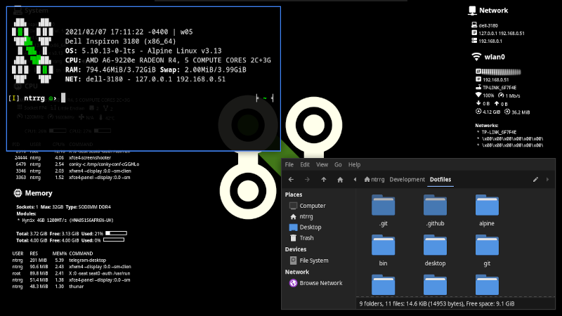

  

  

## Requirements

- [Wayland](https://wayland.freedesktop.org) >= 1.24.0
- [River](https://codeberg.org/river/river) >= 0.3.13
- [Waybar](https://waybar.org/) >= 0.14.0
- [Rofi](https://github.com/davatorium/rofi) >= 1.7.9
- [Hurmit Nerd Font](https://www.nerdfonts.com/)
- [Everforest GTK and icon theme](https://github.com/Fausto-Korpsvart/Everforest-GTK-Theme)
- [Phinger Cursors theme](https://github.com/phisch/phinger-cursors)

## Features

- True black colors.

- Simple panel.

  1. Workspaces (tags).
  2. Application title.
  3. Clock.
  4. Tray area.
  5. Keyboard layout controls.
  6. Audio controls.
  7. Network monitors.
  8. Brightness indicator.
  9. Battery indicator.
  10. System monitor (CPU, GPU, memory).
  11. Notification controls.

- No title bars.

- Keyboard shortcuts.

  - <kbd>Alt</kbd> + <kbd>Shift</kbd> + <kbd>F4</kbd> -> Close window manager.
  - <kbd>Alt</kbd> + <kbd>F4</kbd> -> Close window.
  - <kbd>Alt</kbd> + <kbd>F11</kbd> -> Toggle full screen.
  - <kbd>Alt</kbd> + <kbd>F12</kbd> -> Toggle floating.
  - <kbd>⌘</kbd> + <kbd>Esc</kbd> -> Enter normal mode.
  - <kbd>⌘</kbd> + <kbd>F12</kbd> -> Toggle pass through mode (enable/disable all windows manager keybindings).
  - <kbd>⌘</kbd> + <kbd>P</kbd> -> Open display settings.
  <!-- - <kbd>⌘</kbd> + <kbd>I</kbd> -> Invert screen colors (`xcalib`). -->
  <!-- - <kbd>⌘</kbd> + <kbd>K</kbd> -> Start `xkill`. -->
  - <kbd>⌘</kbd> + <kbd>Delete</kbd> -> Turn off screen.
  - <kbd>⌘</kbd> + <kbd>Shift</kbd> + <kbd>Delete</kbd> -> Lock screen.
  - <kbd>⌘</kbd> + <kbd>Ctrl</kbd> + <kbd>Shift</kbd> + <kbd>Delete</kbd> -> Suspend.
  - <kbd>⌘</kbd> + <kbd>B</kbd> -> Launch status bar.
  - <kbd>⌘</kbd> + <kbd>Shift</kbd> + <kbd>B</kbd> -> Close status bar.
  - <kbd>⌘</kbd> + <kbd>D</kbd> -> Dismiss first notification.
  - <kbd>⌘</kbd> + <kbd>Shift</kbd> + <kbd>D</kbd> -> Dismiss all notifications.
  - <kbd>⌘</kbd> + <kbd>S</kbd> -> Silence notifications.

  **Applications:**

  - <kbd>⌘</kbd> + <kbd>Space</kbd> -> Open application launcher.
  - <kbd>⌘</kbd> + <kbd>Shift</kbd> + <kbd>Space</kbd> -> Run a command.
  - <kbd>⌘</kbd> + <kbd>F</kbd> -> Open default file manager.
  - <kbd>⌘</kbd> + <kbd>M</kbd> -> Open messaging application.
  - <kbd>⌘</kbd> + <kbd>N</kbd> -> Open notes application.
  - <kbd>⌘</kbd> + <kbd>T</kbd> -> Open default terminal.
  - <kbd>⌘</kbd> + <kbd>Shift</kbd> + <kbd>T</kbd> -> Open default terminal as floating window.
  - <kbd>⌘</kbd> + <kbd>W</kbd> -> Open default web browser.
  - <kbd>⌘</kbd> + <kbd>Shift</kbd> + <kbd>W</kbd> -> Open default web browser in incognito mode.

  **Workspaces:**

  - <kbd>⌘</kbd> + <kbd>1-9</kbd> -> Go to workspace 1-9.
  - <kbd>⌘</kbd> + <kbd>Shift</kbd> + <kbd>1-9</kbd> -> Move window to workspace 1-9.
  - <kbd>⌘</kbd> + <kbd>0</kbd> -> Go to scratchpad.
  - <kbd>⌘</kbd> + <kbd>Shift</kbd> + <kbd>0</kbd> -> Move window to scratchpad.

  **Layout:**

  - <kbd>Super</kbd> + <kbd>Enter</kbd> -> Set as main window.
  - <kbd>Alt</kbd> + <kbd>Tab</kbd> -> Cycle windows.
  - <kbd>Alt</kbd> + <kbd>Shift</kbd> + <kbd>Tab</kbd> -> Reverse cycle windows.
  - <kbd>⌘</kbd> + <kbd>F1</kbd> -> Enter layout mode.
    - <kbd>↑</kbd> -> Increment main window count.
    - <kbd>↓</kbd> -> Decrement main window count.
    - <kbd>←</kbd> -> Decrement main window size.
    - <kbd>→</kbd> -> Increment main window size.
    - <kbd>Alt</kbd> + <kbd>Shift</kbd> + <kbd>↑</kbd> -> Position main window in the top.
    - <kbd>Alt</kbd> + <kbd>Shift</kbd> + <kbd>↓</kbd> -> Position main window in the bottom.
    - <kbd>Alt</kbd> + <kbd>Shift</kbd> + <kbd>←</kbd> -> Position main window in the left.
    - <kbd>Alt</kbd> + <kbd>Shift</kbd> + <kbd>→</kbd> -> Position main window in the right.

  **Floating:**

  - <kbd>⌘</kbd> + <kbd>F2</kbd> -> Enter float mode.
    - <kbd>↑</kbd> -> Move window up.
    - <kbd>↓</kbd> -> Move window down.
    - <kbd>←</kbd> -> Move window left.
    - <kbd>→</kbd> -> Move window right.
    - <kbd>Alt</kbd> + <kbd>Shift</kbd> + <kbd>↑</kbd> -> Increase window size horizontally.
    - <kbd>Alt</kbd> + <kbd>Shift</kbd> + <kbd>↓</kbd> -> Decrease window size horizontally.
    - <kbd>Alt</kbd> + <kbd>Shift</kbd> + <kbd>←</kbd> -> Decrease window size vertically.
    - <kbd>Alt</kbd> + <kbd>Shift</kbd> + <kbd>→</kbd> -> Increase window size vertically.

  **Screens:**

  - <kbd>⌘</kbd> + <kbd>Tab</kbd> -> Focus next screen.
  - <kbd>⌘</kbd> + <kbd>Shift</kbd> + <kbd>Tab</kbd> -> Focus previous screen.
  - <kbd>⌘</kbd> + <kbd>Alt</kbd> + <kbd>Tab</kbd> -> Move window to the next screen.
  - <kbd>⌘</kbd> + <kbd>Alt</kbd> + <kbd>Shift</kbd> + <kbd>Tab</kbd> -> Move window to the previous screen.
  - <kbd>⌘</kbd> + <kbd>F3</kbd> -> Enter screen mode.
    - <kbd>↑</kbd> -> Focus screen up.
    - <kbd>↓</kbd> -> Focus screen down.
    - <kbd>←</kbd> -> Focus screen left.
    - <kbd>→</kbd> -> Focus screen right.
    - <kbd>Alt</kbd> + <kbd>Shift</kbd> + <kbd>↑</kbd> -> Move window one screen up.
    - <kbd>Alt</kbd> + <kbd>Shift</kbd> + <kbd>↓</kbd> -> Move window one screen down.
    - <kbd>Alt</kbd> + <kbd>Shift</kbd> + <kbd>←</kbd> -> Move window one screen left.
    - <kbd>Alt</kbd> + <kbd>Shift</kbd> + <kbd>→</kbd> -> Move window one screen right.

