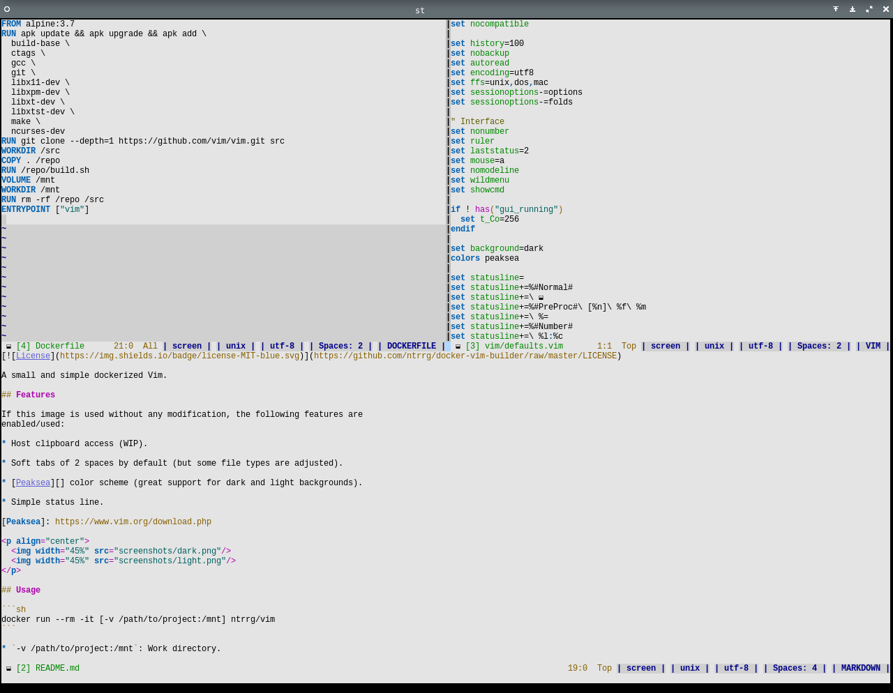

**Requirements:**

* Vim >= 8.1

## Features

* Relative line numbers.

* Soft tabs of 2 spaces by default (but some file types are adjusted).

* Simple status line.

  

    
  

  1. Status bar icon.
  2. Buffer number.

  3. Modified tag, `[+]` if modified, `[-]` if file can't be modified or none
     if any changes were saved.

  4. File base name.
  5. Line number, column number and virtual column number.
  6. Percentage through file.
  7. Terminal in use.
  8. File format (`dos` -> `\r\n`, `mac` -> `\r`, `unix` -> `\n`).
  9. File encoding.
  10. Tab style.
  11. File type.

* [Peaksea][] color scheme (great support for dark and light backgrounds).

  

    
    
  

  Use `:set background=dark` and `:set background=light` respectively for
  enabling them.

* Key shortcuts (Normal mode)

  * `[q` -> `:cprev
`
  * `]q` -> `:cnext
`
  * `[Q` -> `:cfirst
`
  * `]Q` -> `:clast
`

[Peaksea]: https://www.vim.org/scripts/script.php?script_id=760

