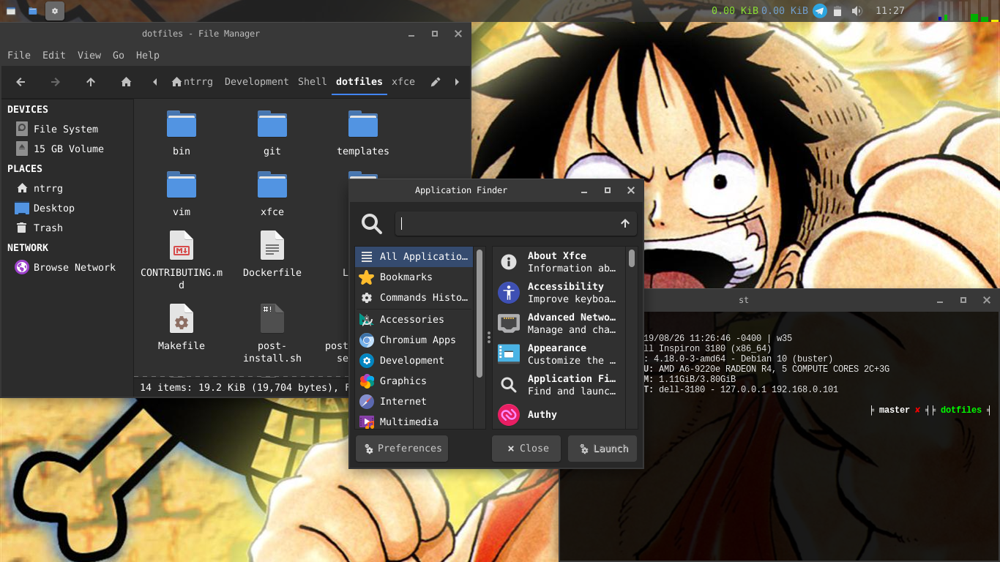

## Requirements

* [XFCE](https://xfce.org) >= 4.12

## Features

  

* Simple panel.

  1. Open applications.
  2. Network monitor.
  3. Notification area.
  4. Audio controls.
  5. Clock.
  6. Timer.
  7. System monitor.
  8. HDD I/O monitor.
  9. Temperature monitor.

* [Materia GTK theme](https://github.com/nana-4/materia-theme).
* [Papirus icon theme](https://git.io/papirus-icon-theme).

* Keyboard shortcuts.

  **Applications:**

  * <kbd>⌘</kbd> + <kbd>Space</kbd> -> Open application launcher.
  * <kbd>⌘</kbd> + <kbd>F</kbd> -> Open default file manager.
  * <kbd>⌘</kbd> + <kbd>M</kbd> -> Open Telegram.
  * <kbd>⌘</kbd> + <kbd>T</kbd> -> Open default terminal.
  * <kbd>⌘</kbd> + <kbd>W</kbd> -> Open default web browser.

  **Functions:**

  * <kbd>⌘</kbd> + <kbd>PrtSrc</kbd> -> Open screenshot tool.
  * <kbd>⌘</kbd> + <kbd>Delete</kbd> -> Suspend.
  * <kbd>⌘</kbd> + <kbd>↑</kbd> -> Toggle vertical maximize window.
  * <kbd>⌘</kbd> + <kbd>→</kbd> -> Toggle horizontal maximize window.
  * <kbd>⌘</kbd> + <kbd>↓</kbd> -> Minimize window.
  * <kbd>⌘</kbd> + <kbd>←</kbd> -> Start resize window.
  * <kbd>⌘</kbd> + <kbd>D</kbd> -> Toggle show desktop.
  * <kbd>⌘</kbd> + <kbd>I</kbd> -> Invert screen colors (`xcalib`).
  * <kbd>⌘</kbd> + <kbd>K</kbd> -> Start `xkill`.
  * <kbd>⌘</kbd> + <kbd>L</kbd> -> Lock screen.
  * <kbd>⌘</kbd> + <kbd>P</kbd> -> Open display settings.

  * <kbd>Alt</kbd> + <kbd>F10</kbd> -> Toggle maximize window.
  * <kbd>Alt</kbd> + <kbd>F11</kbd> -> Toggle full screen window.

