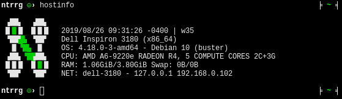

```
▗██▖  ▗██▖             ▗▄▄▄▄▄▖     ▗▖
█▐▌█  █▐▌█         ▐▌  ▝▀▀▀▜▛▘     ▐▌
▝██▘▙ ▝██▘   ▐▙██▖▐███    ▗▛  ▗▟██▖▐▙██▖
 ▐▌▝█▙ ▐▌    ▐▛ ▐▌ ▐▌    ▗▛   ▐▙▄▖▘▐▛ ▐▌
▗██▖▝█▗██▖   ▐▌ ▐▌ ▐▌   ▗▛     ▀▀█▖▐▌ ▐▌
█▐▌█  █▐▌█   ▐▌ ▐▌ ▐▙▄ ▗█▄▄▄▄▖▐▄▄▟▌▐▌ ▐▌ █  █
▝██▘  ▝██▘   ▝▘ ▝▘  ▀▀ ▝▀▀▀▀▀▘ ▀▀▀ ▝▘ ▝▘ ▀  ▀
```

## Requirements

* [Zsh](http://zsh.sourceforge.net/) >= 5.7

## Features

* Host information (`hostinfo`).

  <p align="center">
    
  </p>

* Just type the directory name, `cd` is not needed.

* Simple prompt with Git support.

  <p align="center">
    
    
    
  </p>

  1. Last command exit status (none if `0`).
  2. Username.
  3. User permissions.
  4. Git information (repository name, branch, staged files, modified files).
  5. Current directory.

* Exclude commands from history by preceding them with a white space

* Shared history between terminals.

* Extended GLOB support (`^`, `~`, `#`)

* Keyboard shortcuts:

  * `Ctrl` + `←`: Move the cursor one word backwards.
  * `Ctrl` + `→`: Move the cursor one word forwards.
  * `Ctrl` + `F`: Incremental search forwards.
  * `Ctrl` + `U`: Remove all the characters before the cursor.
  * `Alt` + `H`: Open man page for the current command.
  * `Page Up`: Search up in history using the current characters.
  * `Page Down`: Search down in history using the current characters.

