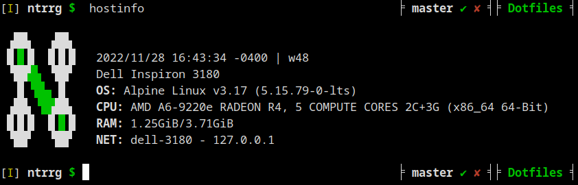

```
▗██▖  ▗██▖             ▗▄▄▄▄▄▖     ▗▖
█▐▌█  █▐▌█         ▐▌  ▝▀▀▀▜▛▘     ▐▌
▝██▘▙ ▝██▘   ▐▙██▖▐███    ▗▛  ▗▟██▖▐▙██▖
 ▐▌▝█▙ ▐▌    ▐▛ ▐▌ ▐▌    ▗▛   ▐▙▄▖▘▐▛ ▐▌
▗██▖▝█▗██▖   ▐▌ ▐▌ ▐▌   ▗▛     ▀▀█▖▐▌ ▐▌
█▐▌█  █▐▌█   ▐▌ ▐▌ ▐▙▄ ▗█▄▄▄▄▖▐▄▄▟▌▐▌ ▐▌ █  █
▝██▘  ▝██▘   ▝▘ ▝▘  ▀▀ ▝▀▀▀▀▀▘ ▀▀▀ ▝▘ ▝▘ ▀  ▀
```

## Requirements

* [Zsh](http://zsh.sourceforge.net/) >= 5.8

## Features

* Host information (`hostinfo`).

  <p align="center">
    
  </p>

* Vim-like key bindings (*Insert* mode by default).

* Just type the directory name, `cd` is not needed.

* Simple prompt with Git support.

  <p align="center">
    
  </p>

  <p align="center">
    
  </p>

  <p align="center">
    
  </p>

  1. Vim mode (`I` for *Insert* mode, `N` for *Normal* mode).
  2. Last command exit status (none if `0`).
  3. Username.
  4. User permissions.
  5. Git information (reference, staged files, modified files).
  6. Current directory.

* Exclude commands from history by preceding them with a white space.

* Shared history between terminal sessions.

* Extended GLOB support (`^`, `~`, `#`)

* Keyboard shortcuts (*Insert* mode):

  * `Ctrl` + `←`: Move the cursor one word backwards.
  * `Ctrl` + `→`: Move the cursor one word forwards.

  * `Ctrl` + `R`: Search backward in history for the given string (GLOB
    patterns supported).

  * `Ctrl` + `F`: Search forward in history for the given string (GLOB patterns
    supported).

  * `Page Up`: Search up in history using the current characters.
  * `Page Down`: Search down in history using the current characters.
  * `Ctrl` + `X`, `Ctrl` + `E`: Edit the current command with `$EDITOR`.

